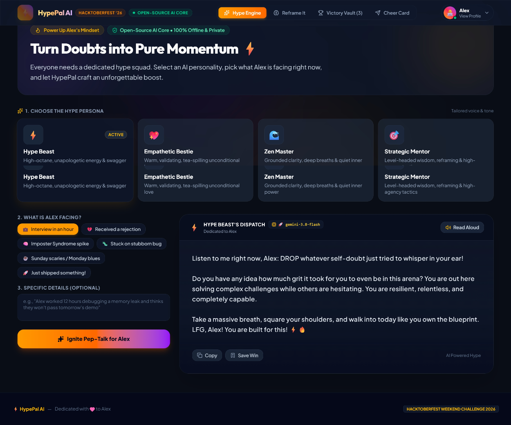
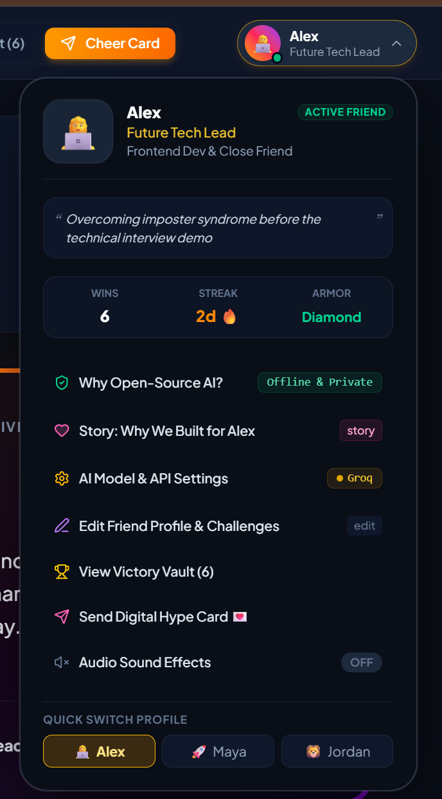
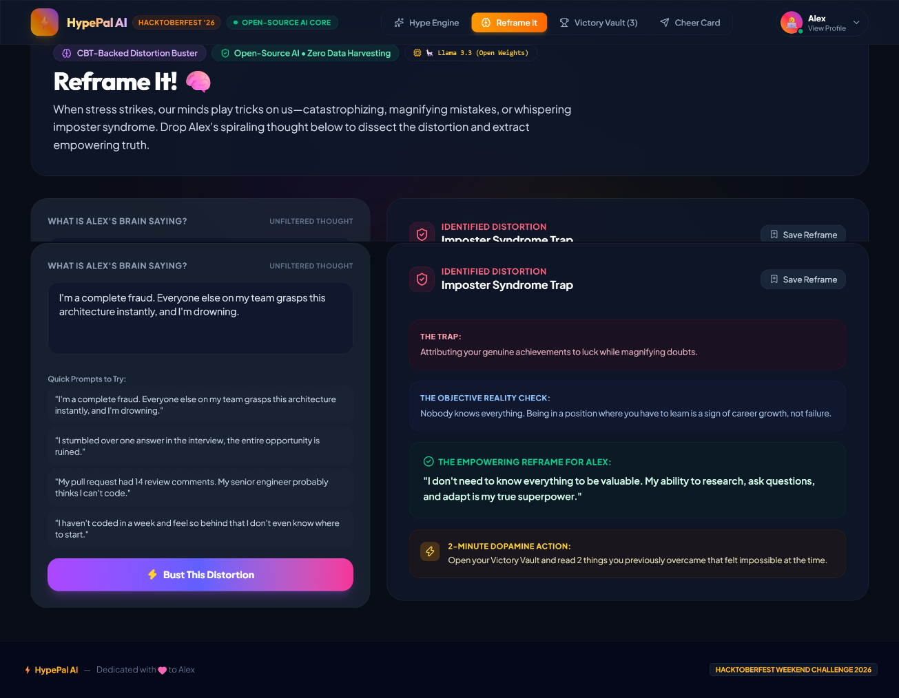
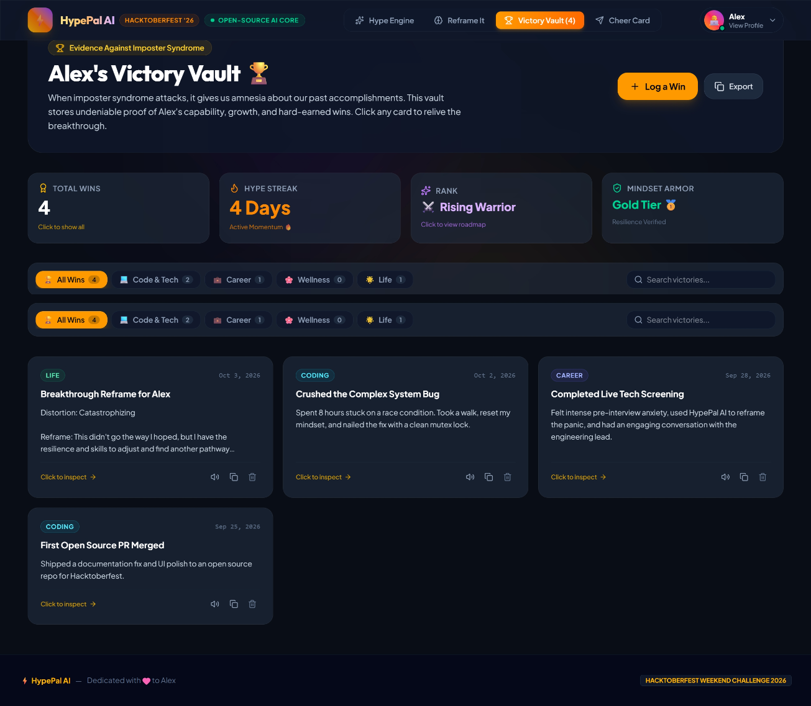
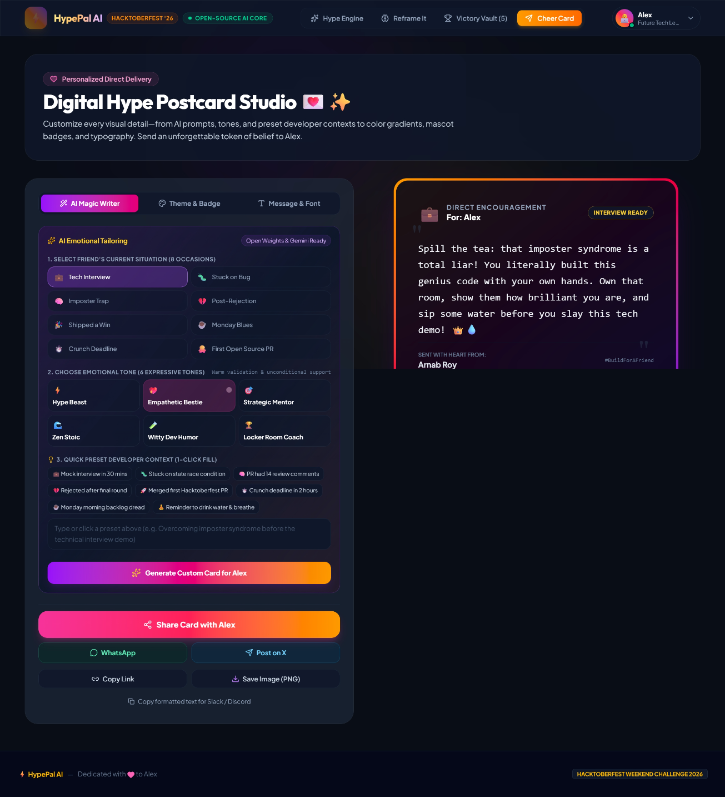

# ⚡ HypePal AI — Personal Cheerleader & Mindset Coach

[](https://dev.to/challenges/hacktoberfest-weekend-2026-10-01)
[](https://arnab825.github.io/HyperPal-AI/)
[](https://react.dev/)
[](https://tailwindcss.com/)
[](./LICENSE)
[](./docs/ARCHITECTURE.md)
[](./docs/PRD.md)
[](./docs/TRD.md)
[](./docs/THEME_AND_DESIGN_SYSTEM.md)

> **Dedicated to Alex (and every friend battling imposter syndrome, pre-interview anxiety, or burnout).**  
> Built with open-source AI at its core for the **[Hacktoberfest Weekend Challenge: Build for a Friend](https://dev.to/challenges/hacktoberfest-weekend-2026-10-01)**.  
> 🌐 **Live Demo:** [https://arnab825.github.io/HyperPal-AI/](https://arnab825.github.io/HyperPal-AI/)

---

<p align="center">
  
</p>

---

## 💡 The Inspiration & Story: Why We Built for a Friend

When major technical interviews approach, complex distributed bugs refuse to yield, or PR reviews pile up, self-doubt strikes. Traditional task managers, Jira boards, and calendars treat developers like machines—shoving red deadline badges and overdue alerts into our faces.

**HypePal AI** is built differently: it treats engineers and creators like **human beings**.

We built this for **Alex**, a frontend engineer striving to break through senior technical screenings while silently battling severe imposter syndrome. HypePal AI is their private psychological armor and cheerleader:

- **Passionate, authentic encouragement** tailored to their exact current obstacle.
- **Clinical CBT Cognitive Restructuring** that takes an unfiltered anxious thought and breaks it down into empowering truth with clinical precision.
- **A Permanent Victory Vault & Brag Sheet** calculating genuine calendar-day streaks and tracking undeniable empirical proof of resilience.
- **Digital Cheer Cards** that can be handcrafted with love or composed with AI, then shared via 1-click links to WhatsApp or Slack.
- **100% Private Local Inference (Ollama)** ensuring vulnerable thoughts never leave the developer's laptop.

---

## 📸 Screenshots & Feature Walkthrough

### 1. 🚀 Instant Hype Engine (Multi-Persona Cheer Squad)
Choose from 4 distinct AI personalities tailored to what your friend needs at that exact moment:
- ⚡ **Hype Beast:** High-voltage swagger, unapologetic belief, and electric motivation.
- 💖 **Empathetic Bestie:** Warm, validating, tea-spilling unconditional love.
- 🌊 **Zen Master:** Grounded calmness, breath resets, and quiet inner resilience.
- 🎯 **Strategic Mentor:** High-agency tactical perspective and evidence-based framing.

<p align="center">
  
</p>

- **Web Speech API Voice Coach:** Browser-native Text-to-Speech (TTS) with an animated real-time audio waveform visualizer.
- **Celebration Confetti & 1-Click Vault Save:** Celebrate breakthroughs with instant confetti bursts and save memorable quotes straight to the vault.

---

### 2. ⚙️ Multi-Engine AI Architecture (Open-Source AI at the Core)
Seamlessly switch between lightning-fast cloud open weights and 100% offline local privacy:

<p align="center">
  
</p>

- **Local Ollama (100% Offline & Zero Data Harvesting):** Run open-weight models (`llama3.2`, `mistral`, `gemma2`) locally at `http://localhost:11434`. Zero bytes leave the machine, giving complete psychological safety when sharing raw anxieties.
- **Groq Open Weights:** Ultra-fast open-weight inference with **Llama 3.3 70B**, **DeepSeek R1**, and **Qwen 2.5 32B** at 750+ tokens/second for free.
- **Google Gemini:** Native support for the latest Gemini 3.8 Flash, 3.7 Flash, and 3.6 Flash.
- **Built-in Heuristic Offline Engine:** Guaranteed zero-crash fallback even without internet access or API keys.

---

### 3. 👤 Modern Friend Profile Dropdown & Quick Customizer
A polished profile drawer inspired by GitHub, Linear, and Notion that puts your friend front and center:

<p align="center">
  
</p>

- **Live Friend Challenge Quote:** Shows what your friend is currently tackling (*"Overcoming imposter syndrome before the technical interview demo"*).
- **Synchronized Mini-Stats:** Live counter displaying Verified Wins, active streak days, and Mindset Armor tier.
- **Quick Friend Switcher:** One-click toggling between sample friend personas (Alex, Jordan, Maya) or full custom profile editing.
- **Audio FX Controls:** Integrated toggle for spatial pop and chime sound effects.

---

### 4. 🧠 "Reframe It!" — Clinical CBT Cognitive Distortion Buster
When stress strikes, the human brain magnifies mistakes and catastrophizes outcomes. "Reframe It!" dismantles spirals with clinical Cognitive Behavioral Therapy (CBT) precision:

<p align="center">
  
</p>

- **Distortion Focus Lenses:** Quick-filter lenses for `🎯 Auto-Detect`, `🧠 Imposter Syndrome`, `💥 Catastrophizing`, `🐙 PR Review Panic`, `⏱️ Inaction & Dread`, and `⚖️ Perfectionism`.
- **6 Developer Scenarios:** Real-world engineering situations (14 PR review comments, stumbling on mock interviews, architecture overwhelm).
- **Algorithmic Match Precision & Neurological Trigger:** Identifies the distortion match percentage (e.g. *97% Match*) and pinpoints the underlying neurological trigger.
- **4-Pillar CBT Restructuring:**
  1. **The Trap:** Explains the irrational cognitive bias.
  2. **Objective Reality Check:** Grounds the user with undeniable counter-evidence.
  3. **Empowering Socratic Reframe:** Formulates a rational, confidence-restoring mindset.
  4. **2-Minute Dopamine Micro-Action:** Low-friction behavioral experiment to restart momentum.
- **Action Pipeline:** 1-click **"Save as Breakthrough to Vault"** (automatically logs into the Victory Vault), **"Send as Cheer Card"**, and browser voice read-aloud.

---

### 5. 🏆 Alex's Victory Vault & Mathematical Resilience Shield
Imposter syndrome causes amnesia about past accomplishments. The Victory Vault serves as an undeniable externalized hard-evidence locker:

<p align="center">
  
</p>

- **Deterministic Calendar-Day Streak Engine:** Computed using strict $\Delta t = 24\text{ hours}$ local midnight timestamp comparisons (zero random number generators).
- **4 Interactive Metric Deep-Dives:**
  - **Total Wins:** Domain breakdown across Code & Tech, Career, Wellness, and Life.
  - **Hype Streak:** 7-day consistency calendar matrix and 14-day momentum rate.
  - **Rank Roadmap:** Clear progression tiers (*🌱 Spark Starter* ➔ *⚔️ Rising Warrior* ➔ *⚡ Unstoppable Titan* ➔ *👑 Mythic Architect*).
  - **Mindset Armor:** Psychological defense index (*💎 Diamond Tier 98% Imposter Defense*).
- **Smart "+ Log a Win" Modal:**
  - Dedicated centered modal with fixed header, scrollable body, and pinned footer.
  - `✨ Auto-Fill with AI` and `✨ Polish with AI` to turn rough milestones into brag-sheet bullets.
  - 1-click quick preset idea chips.
  - Option to automatically pre-fill and forward the victory as a Cheer Card.
- **Zero Scrollbar Clutter:** Built with background body scroll locking (`document.body.style.overflow = 'hidden'`) and React `createPortal`, completely eliminating overlapping double scrollbars (`||`) and mobile navbar collisions.
- **1-Click Markdown Export:** Generates formatted brag sheets ready for 1-on-1s, performance reviews, and interview retrospectives.

---

### 6. 💌 Digital Hype Postcard Studio
A vibrant creator studio for composing and sending personalized digital cards directly to friends:

<p align="center">
  
</p>

- **Fluid Mode Switcher:** Smooth liquid animated sliding pill toggle between **"✍️ Write My Own"** (Handcrafted custom text, zero AI) and **"✨ AI Magic Composer"**.
- **Context-Aware Controls:** Automatically hides AI tone controls and model selectors when writing handcrafted cards to keep the canvas clean.
- **4 Vibrant Aesthetic Themes:** *Neon Cyber*, *Golden Sunset*, *Emerald Aurora*, and *Deep Space*.
- **Interactive Live Preview:** Real-time preview card with glowing gradients, stamp badges, and direct delivery options.
- **Direct Delivery Pipeline:** One-click links for **WhatsApp**, **Slack**, clipboard copy, or shareable URL parameters.

---


---

## 📚 Engineering & Design Documentation Suite

For judges, contributors, and developers interested in our technical architecture and product design, explore our full documentation suite in the [`docs/`](./docs) folder:

| Document | Purpose & Contents | Link |
| :--- | :--- | :--- |
| **🏛️ System Architecture** | High-level topology, Mermaid sequence diagrams, multi-engine inference cascade, mathematical streak formulas, and audio waveform engines. | [**docs/ARCHITECTURE.md**](./docs/ARCHITECTURE.md) |
| **📋 Product Requirements (PRD)** | Problem statement, target personas, functional requirements (FR1–FR6), non-functional requirements (NFRs), and success KPIs. | [**docs/PRD.md**](./docs/PRD.md) |
| **🛠️ Technical Requirements (TRD)** | Data schemas (`VictoryWin`, `FriendProfile`, `AISettings`), API contracts (Ollama, Groq, Gemini), stacking context portals, and build budgets. | [**docs/TRD.md**](./docs/TRD.md) |
| **🎨 Theme & Design System** | Color tokens (Obsidian Void, Radiant Amber, etc.), typography scale, glassmorphism physics, postcard themes, and Web Audio haptics. | [**docs/THEME_AND_DESIGN_SYSTEM.md**](./docs/THEME_AND_DESIGN_SYSTEM.md) |
| **💖 "Build for a Friend" Alignment** | Real-world story of Alex, mapping psychological hurdles to software features, and hand-off validation interview. | [**docs/BUILD_FOR_A_FRIEND_THEME.md**](./docs/BUILD_FOR_A_FRIEND_THEME.md) |

## 🛠️ Architecture & Tech Stack

> 📖 **Deep Dive Documentation:** For full system topology, Mermaid sequence diagrams, clinical CBT formulas, and mathematical streak specifications, read the complete [docs/ARCHITECTURE.md](./docs/ARCHITECTURE.md).

- **Frontend Core:** React 19.2 (Vite 8)
- **Styling & Design System:** Tailwind CSS v4 (`@tailwindcss/vite`) with custom dark-mode glassmorphism
- **AI Integrations:**
  - Open-Source Local: **Ollama API** (`http://localhost:11434/api/generate`)
  - Open-Weights Cloud: **Groq Cloud API** (`llama-3.3-70b-versatile`, `deepseek-r1-distill-llama-70b`, `qwen-2.5-32b`)
  - Cloud Flagship: **Google Gemini API** (`gemini-3.8-flash`, `gemini-3.7-flash`, `gemini-3.6-flash`)
- **Voice & Audio:** HTML5 Web Speech Synthesis API with custom animated audio waveforms
- **Modals & Overlays:** React `createPortal` with strict body scroll locking and non-conflicting stacking contexts
- **Mathematical Gamification:** Deterministic timestamp differencing calendar engine
- **Local Sovereignty:** Client-side `localStorage` persistence with zero telemetry
- **Deployment:** GitHub Pages via GitHub Actions CI/CD

---

## 🚀 Quickstart Guide

### 1. Clone the repository
```bash
git clone https://github.com/arnab825/HyperPal-AI.git
cd HyperPal-AI
```

### 2. Install dependencies
```bash
npm install
```

### 3. (Optional) Configure environment variables
Copy `.env.example` to `.env` if you want to provide pre-configured keys:
```bash
cp .env.example .env
```

### 4. Run development server
```bash
npm run dev
```
Open [http://localhost:5173](http://localhost:5173) in your browser!

### 5. Running 100% Offline with Ollama (Optional)
If you have [Ollama](https://ollama.com/) installed on your machine:
```bash
ollama run llama3.2
```
In HypePal AI, open **Settings**, select **Ollama (100% Offline)**, and enjoy complete local AI coaching with zero internet connection!

### 6. Build for production
```bash
npm run build
```

---

## 🏆 Hacktoberfest Weekend Challenge Submission

- **Challenge Theme:** [Hacktoberfest Weekend Challenge: Build for a Friend](https://dev.to/challenges/hacktoberfest-weekend-2026-10-01)
- **Built for:** Alex (Frontend Developer preparing for senior engineering screenings)
- **Why Open-Source AI Matters Here:**
  1. **Data Sovereignty:** Vulnerable thoughts typed during an imposter spiral should never be retained by proprietary servers to train closed models.
  2. **Zero Barrier to Entry:** Open weights run for $0.00 locally or via free Groq cloud tiers, eliminating subscription anxiety for job seekers.
  3. **Unsanitized Empathy:** Open models avoid sterile corporate guardrails and allow genuine, deeply validating encouragement and structured CBT reasoning.

---

## 📄 License
This project is open source and available under the [MIT License](./LICENSE).
