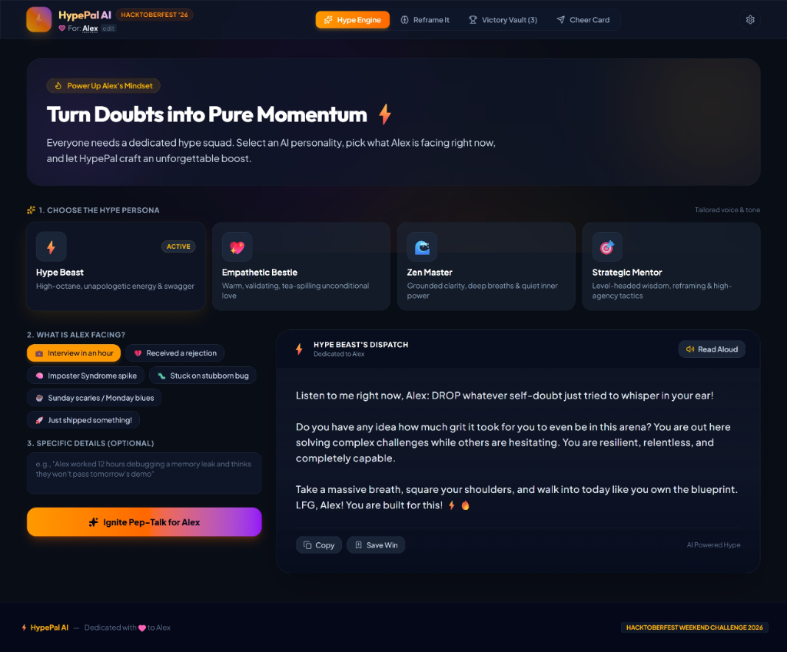
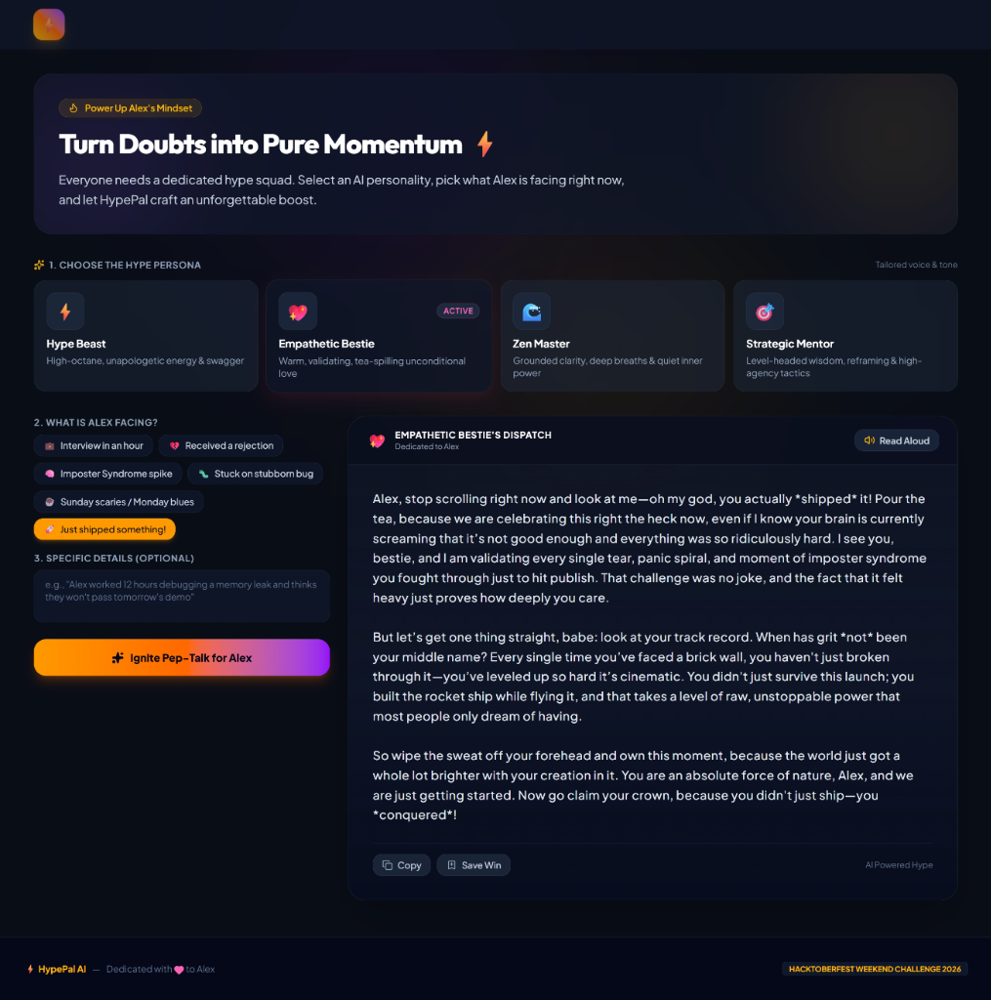
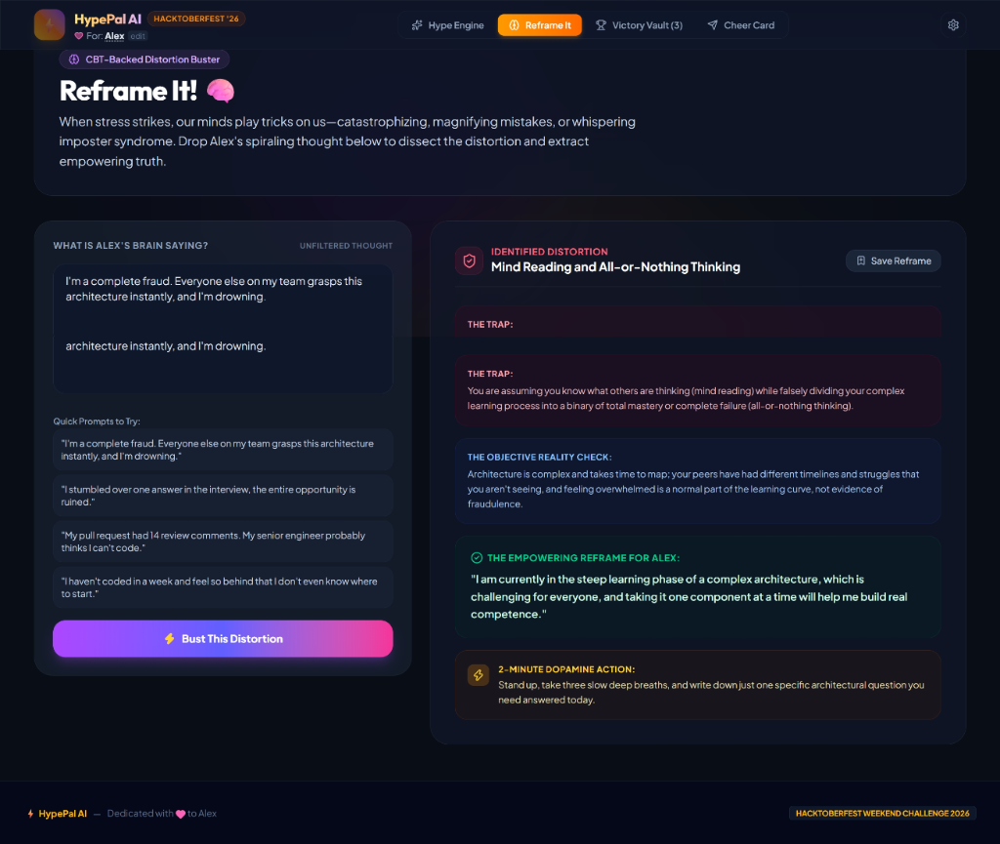
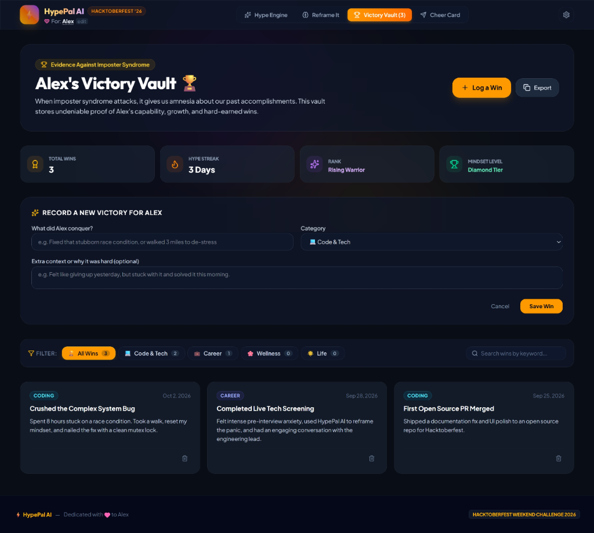
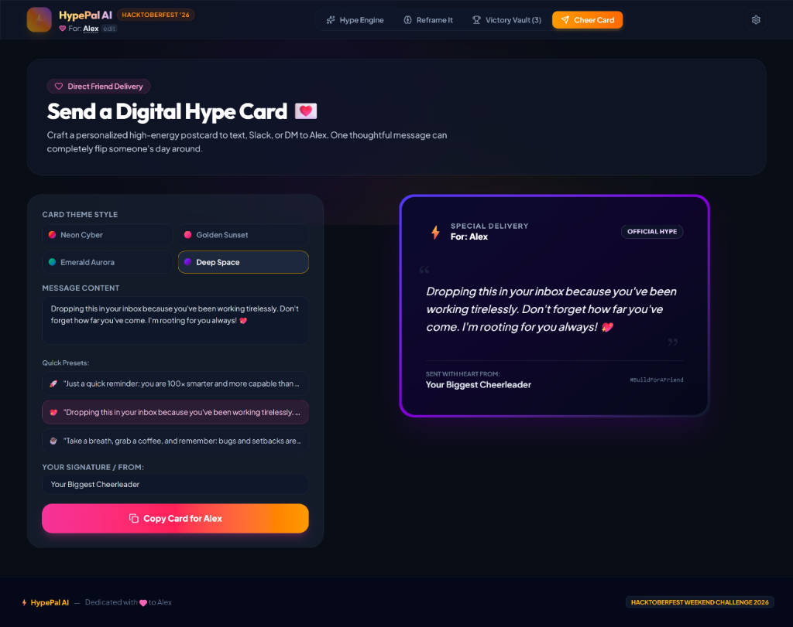
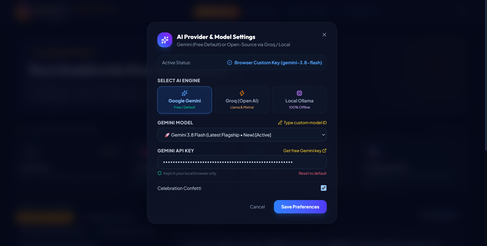

# ⚡ HypePal AI — Personal Cheerleader & Mindset Coach

[](https://dev.to/challenges/hacktoberfest-weekend-2026-10-01)
[](https://arnab825.github.io/HyperPal-AI/)
[](https://react.dev/)
[](https://tailwindcss.com/)
[](./LICENSE)

> **Dedicated to a Friend battling imposter syndrome, pre-interview anxiety, or burnout.**  
> Built for the **[Hacktoberfest Weekend Challenge: Build for a Friend](https://dev.to/challenges/hacktoberfest-weekend-2026-10-01)**.  
> 🌐 **Live Demo:** [https://arnab825.github.io/HyperPal-AI/](https://arnab825.github.io/HyperPal-AI/)

---

<p align="center">
  
</p>

---

## 💡 The Inspiration & Story

When deadlines loom, technical interviews approach, or complex bugs refuse to yield, self-doubt creeps in. Traditional task managers and calendars treat us like machines—throwing red badges and overdue alarms at our faces.

**HypePal AI** is built differently: it treats engineers and creators like **human beings**.

Designed as a personal hype squad, HypePal gives your friend an emotional safety net:
- High-voltage, personalized encouragement delivered with realistic AI voices.
- CBT-informed distortion reframing to dismantle spiraling thoughts in seconds.
- A permanent **Victory Vault** to remind them of every hard thing they have previously overcome.
- Shareable digital pep-postcards to drop straight into their inbox, Slack, or WhatsApp.
- 100% private local inference support (Ollama) so private thoughts never leave their machine.

---

## 📸 Screenshots & Showcase

### 1. 🚀 Instant Hype Generator (With Voice Synthesis & Waveform)
Choose from 4 distinct AI personalities tailored to what your friend is facing right now:
- ⚡ **Hype Beast:** Unapologetic high-energy motivation and swagger.
- 💖 **Empathetic Bestie:** Warm, validating, tea-spilling unconditional love.
- 🌊 **Zen Master:** Grounded clarity, breath resets, and quiet inner resilience.
- 🎯 **Strategic Mentor:** High-agency tactical perspective and evidence-based framing.

<p align="center">
  
</p>

- **Web Speech API Read-Aloud:** Browser-native Text-to-Speech (TTS) with an animated real-time audio waveform visualizer.
- **Celebration Confetti & 1-Click Copy:** Celebrate wins and paste straight to friends or chat.

---

### 2. 🧠 "Reframe It!" (Cognitive Distortion Buster)
Grounded in Cognitive Behavioral Therapy (CBT) principles to deconstruct negative spirals into empowering truth:
- **Identifies Traps:** *Catastrophizing*, *Mind Reading*, *All-or-Nothing Thinking*, *Imposter Trap*.
- **Objective Reality Check:** Clear evidence contradicting the negative loop.
- **2-Minute Dopamine Micro-Action:** An immediate, low-friction action to build real momentum.

<p align="center">
  
</p>

---

### 3. 🏆 Alex's Victory Vault (The Brag Sheet)
An undeniable evidence locker against imposter syndrome:
- **Milestone & Streak Tracking:** Dynamic rank promotions (*Spark Starter* ➔ *Rising Warrior* ➔ *Unstoppable Titan*).
- **Instant Search & Category Filters:** Categorize across *Tech/Code*, *Career*, *Wellness*, and *Life*.
- **1-Click Markdown Export:** Export all wins into a clean markdown brag sheet ready for performance reviews or 1-on-1s.

<p align="center">
  
</p>

---

### 4. 💌 Send a Digital Hype Card (Direct Friend Delivery)
Craft and deliver high-energy, personalized digital postcards to text, Slack, or DM directly to your friend:
- **4 Vibrant Aesthetic Themes:** *Neon Cyber*, *Golden Sunset*, *Emerald Aurora*, and *Deep Space*.
- **1-Click Quick Presets:** Fast curated encouragement messages with zero text overlap.
- **Instant Live Preview:** Real-time preview card with glowing gradients and one-click clipboard copy.

<p align="center">
  
</p>

---

### 5. ⚙️ Multi-Engine AI Architecture (Cloud & 100% Offline)
Switch seamlessly between cloud acceleration and complete local privacy:
- **Google Gemini (Default):** Native support for latest Gemini 3.8 Flash, 3.7 Flash, 3.6 Flash, and 2.5 models.
- **Groq Open AI:** Ultra-fast open-weight inference with Llama 3.3 70B, DeepSeek R1 Distill, Qwen 2.5 32B, and Mixtral.
- **Local Ollama (100% Offline & Private):** Run open-weight models (`llama3.2`, `mistral`, `gemma2`) directly at `http://localhost:11434` with zero API keys and zero internet.
- **Built-in Procedural Offline Engine:** Automatically guarantees the app never crashes even without internet connection or API keys.

<p align="center">
  
</p>

---

## 🛠️ Tech Stack

- **Frontend Framework:** React 19 (Latest)
- **Styling:** Tailwind CSS v4 (`@tailwindcss/vite`)
- **Build Tool:** Vite 8
- **Icons:** Lucide React
- **Voice Engine:** HTML5 Web Speech Synthesis API
- **Micro-Interactions:** Canvas Confetti & custom CSS Glassmorphism
- **Storage:** LocalStorage (zero external tracking)
- **Deployment:** GitHub Pages (Automated CI/CD with GitHub Actions)

---

## 🚀 Quickstart Guide

### 1. Clone the repository
```bash
git clone https://github.com/arnab825/HyperPal-AI.git
cd HyperPal-AI
```

### 2. Install dependencies
```bash
npm install
```

### 3. (Optional) Configure environment variables
Copy `.env.example` to `.env` if you want to provide default API keys:
```bash
cp .env.example .env
```

### 4. Run development server
```bash
npm run dev
```
Open [http://localhost:5173](http://localhost:5173) in your browser!

### 5. Build for production
```bash
npm run build
```

---

## 🏆 Hacktoberfest Weekend Challenge Submission

- **Challenge:** [Hacktoberfest Weekend Challenge: Build for a Friend](https://dev.to/challenges/hacktoberfest-weekend-2026-10-01)
- **Built for:** Alex (Junior Developer preparing for technical interviews)
- **Key Partner Categories:** Open-Source AI / Open Weights Integration, Local Inference & Edge AI (Ollama), Best Project Built for a Friend

---

## 📄 License
This project is open source and available under the [MIT License](./LICENSE).
