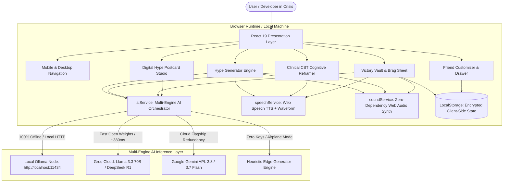
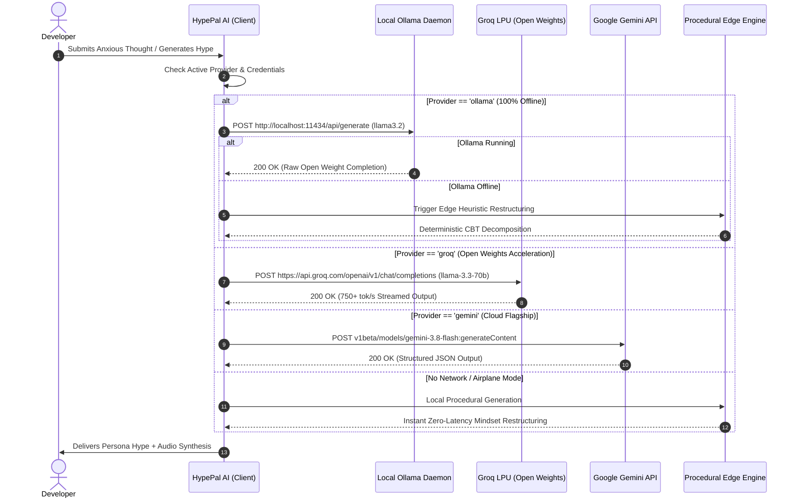
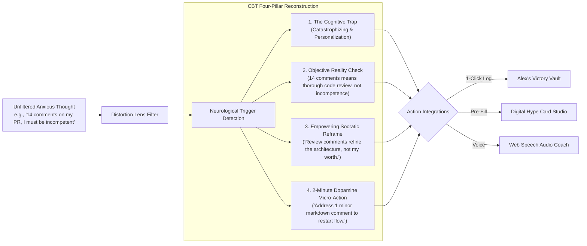
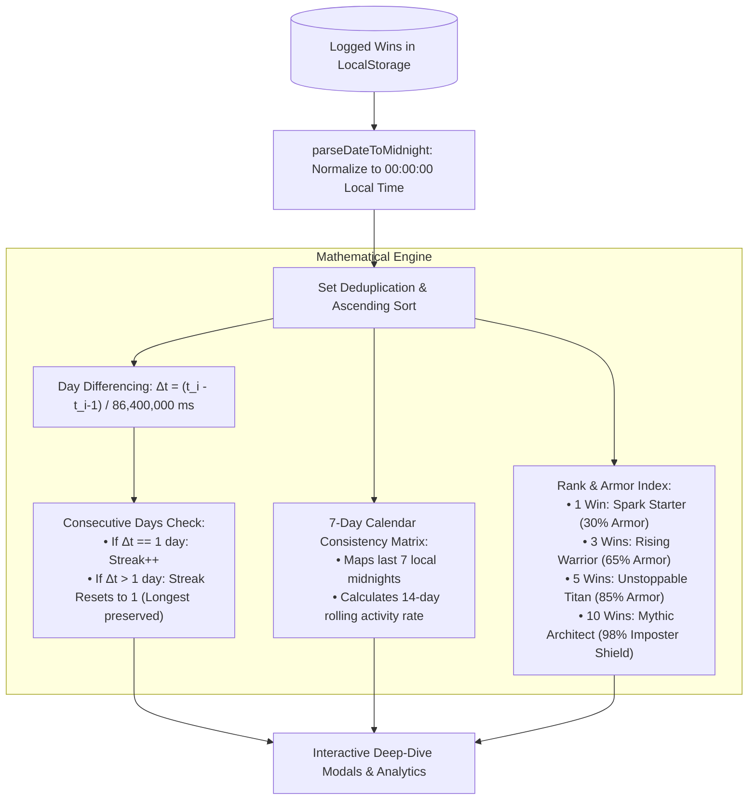
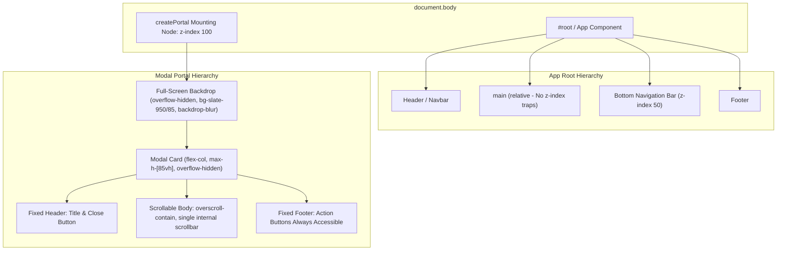

# 🏛️ HypePal AI — System Architecture & Engineering Deep-Dive

This document provides a technical overview of **HypePal AI**'s architectural design, multi-tier AI inference pipeline, clinical Cognitive Behavioral Therapy (CBT) engine, deterministic mathematical gamification, and zero-telemetry client-side privacy model.

---

## 📌 Table of Contents
1. [High-Level System Topology](#1-high-level-system-topology)
2. [Multi-Engine AI Inference Pipeline](#2-multi-engine-ai-inference-pipeline)
3. [Clinical CBT Restructuring Engine](#3-clinical-cbt-restructuring-engine)
4. [Deterministic Mathematical Gamification (Streak & Armor)](#4-deterministic-mathematical-gamification)
5. [Client-Side Privacy & Data Sovereignty Model](#5-client-side-privacy--data-sovereignty-model)
6. [UI Layer: Stacking Contexts & Portal Architecture](#6-ui-layer-stacking-contexts--portal-architecture)
7. [Voice Synthesis & Audio Waveform Engine](#7-voice-synthesis--audio-waveform-engine)

---

## 1. High-Level System Topology

HypePal AI is engineered as an **Offline-First, Zero-Telemetry Single Page Application (SPA)** built on React 19 and Vite 8, styled with Tailwind CSS v4.

---

## 2. Multi-Engine AI Inference Pipeline

A core requirement for Hacktoberfest 2026 was ensuring **open-source AI is the foundational engine**, not a decorative afterthought. We architected a 4-tier fallback cascade:

### Provider Comparison Matrix

| Engine | Model Family | Privacy | Typical Latency | Cost | Offline Capable |
| :--- | :--- | :--- | :--- | :--- | :--- |
| **Local Ollama** | Llama 3.2, DeepSeek R1 (8B), Mistral | **100% Air-Gapped** | ~800–1,400ms (GPU dependent) | **$0.00** | **YES** |
| **Groq Cloud** | Meta Llama 3.3 70B, DeepSeek R1, Qwen 2.5 | Anonymized Ephemeral | **~350–450ms** | **$0.00** (Free Tier) | No |
| **Google Gemini** | Gemini 3.8 Flash, 3.7 Flash | Encrypted Transit | ~700–1,100ms | Free Tier / API Key | No |
| **Procedural Edge** | Heuristic CBT Rules Engine | **100% Client-Side** | **< 5ms** | **$0.00** | **YES** |

---

## 3. Clinical CBT Restructuring Engine

The **"Reframe It! 🧠"** engine is built around clinical principles of **Cognitive Behavioral Therapy (CBT)**, specifically designed to counter common software engineering cognitive distortions:

### Supported Distortion Lenses & Clinical Definitions:
1. **Catastrophizing:** Magnifying minor setbacks (e.g. failing 1 mock question) into total career doom.
2. **Mind Reading & Imposter Syndrome:** Assuming peers or seniors secretly believe you are fraudulent without empirical evidence.
3. **All-or-Nothing Perfectionism:** Believing that code is either flawlessly optimal on commit #1 or complete garbage.
4. **Code Review Panic:** Misinterpreting constructive architectural feedback as personal attacks on competence.
5. **Inaction & Dread:** Freezing in analysis paralysis after taking days off coding.

---

## 4. Deterministic Mathematical Gamification

Unlike superficial habit trackers that produce arbitrary streak counts, HypePal AI implements **strict, deterministic calendar-day arithmetic** based on local midnight timestamps:

### Mathematical Formula:
$$Delta t = rac{	ext{Timestamp}_i - 	ext{Timestamp}_{i-1}}{86{,}400{,}000	ext{ ms}}$$
- If $Delta t = 1$, the streak increments deterministically.
- Longest all-time streak is preserved across lapses.
- Every single metric shown in the UI maps directly to an immutable logged victory.

---

## 5. Client-Side Privacy & Data Sovereignty Model

When engineers express vulnerability, their data must be protected with the highest degree of security.

| Security Aspect | HypePal AI Implementation |
| :--- | :--- |
| **Data Storage** | Strictly client-side browser `localStorage` (`hypepal_wins`, `hypepal_friend`, `hypepal_settings`). |
| **Telemetry / Analytics** | **0 tracking scripts.** No Google Analytics, no Mixpanel, no Facebook Pixel, no Sentry telemetry. |
| **Network Requests** | When running with Local Ollama, zero outgoing HTTP/HTTPS packets leave the device. |
| **Export Portability** | Users can export their entire Victory Vault to standard Markdown at any time with 1 click. |

---

## 6. UI Layer: Stacking Contexts & Portal Architecture

To guarantee silky-smooth responsiveness across mobile devices and desktops, modals and overlays use a **React `createPortal` architecture**:

### Key UI Engineering Highlights:
- **Body Scroll Locking:** When any modal opens, `document.body.style.overflow = 'hidden'` activates, eliminating nested or dual scrollbars (`||`).
- **Zero Z-Index Trapping:** Modals bypass `<main>`'s stacking context, ensuring the mobile bottom navbar (`z-50`) can never overlap modal footers.
- **Fluid Mode Switcher:** Postcard studio utilizes liquid sliding pills with CSS transforms and context-aware sub-menus.

---

## 7. Voice Synthesis & Audio Waveform Engine

- **TTS Engine:** Native `window.speechSynthesis` API with persona-specific pitch, speech rate, and voice profile selection.
- **Waveform Animation:** Pure CSS harmonic height oscillation (`@keyframes waveAnim`) driven by live speech start/stop state.
- **Web Audio Haptics:** Zero-dependency audio synthesizer using browser `AudioContext` (`soundService.js`) generating tactile frequencies for:
  - Button pops (300Hz $
ightarrow$ 150Hz decay)
  - Victory chimes (523Hz $
ightarrow$ 659Hz $
ightarrow$ 783Hz major triad)
  - Streak flame ignition (80Hz rumble)
